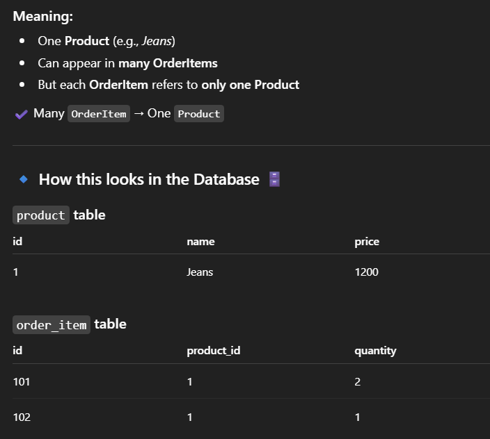
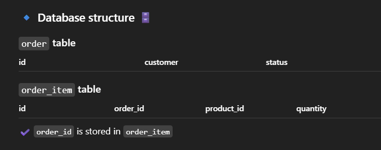
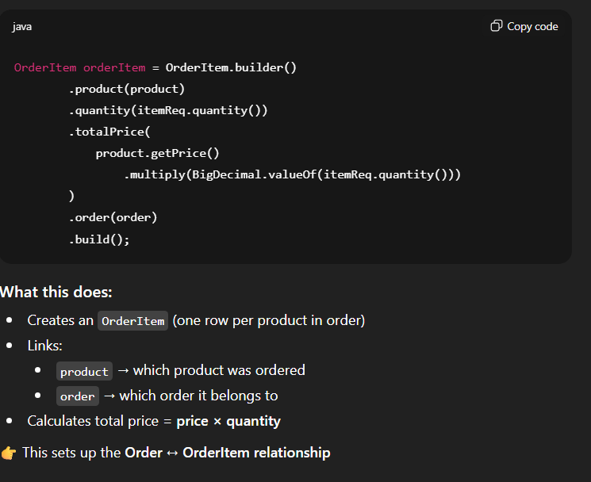

### E-commerce Order Management API

```
@RestController
@RequestMapping("/api")
public class ProductController {

    @GetMapping("/products")
    public String  getProducts() {
        return "Product List";
    }
}
```

`@RequestMapping("/api")` adds **/api** prefix to all endpoints in that controller.

GET http://localhost:8080/api/products

`spring.jpa.hibernate.ddl-auto=update`
* If the table does NOT exist → Hibernate creates it on app startup

*  If the table already exists → Hibernate updates the schema

**ResponseEntity** represents the entire HTTP response, not just the response body.

It lets you control:

* Response body

* HTTP status code

* HTTP headers

### Data Transfer Object: 

A **DTO** is a simple object used only to **carry data between layers** (Controller ↔ Service ↔ Client).

👉 It does NOT:

* Contain business logic

* Map directly to database tables

* Have JPA annotations like `@Entity`

👉 It DOES:

* Control what data comes in (request)

* Control what data goes out (response)

* Protect your database entities

  | Entity               | DTO                  |
  | -------------------- | -------------------- |
  | Maps to DB table     | Maps to API contract |
  | Has `@Entity`, `@Id` | No JPA annotations   |
  | Used by Repository   | Used by Controller   |
  | Can change with DB   | Stable for API       |

**Relationships in DTO:**

```
@ManyToOne
private Product product;
```

`@ManyToOne` represents a relationship where multiple records of one entity reference a single record of another entity, implemented using a foreign key in the database.

* Many records of the current entity
*  are associated with One Product



🔹 What JPA does automatically without writing SQL:

* **Creates a foreign key** column

* Handles JOINs internally

* Fetches related Product when needed.

  ➡️ Client sends ID
  ➡️ Server converts ID → Entity
  ➡️ DTO protects entity from exposure

```
    @ManyToOne
    private Order order;
```

* One Order can have many OrderItems

* Each OrderItem belongs to only one Order

* order_id is a **foreign key**. It links each order item to its order

```
  @OneToMany(mappedBy = "order", cascade = CascadeType.ALL)
  private List<OrderItem> orderItems;
```

It defines a `One-to-Many` relationship:

* One Order &rarr; can have Many OrderItems

This is the parent side of the relationship.

`mappedBy = "order"` means “The relationship is already mapped in OrderItem.order”

So:

* **OrderItem owns the foreign key**

* **Order** does not create another column



What **cascade = CascadeType.ALL** does &rarr; It means operations on Order propagate to OrderItem

| Operation on Order | Effect on OrderItem    |
| ------------------ | ---------------------- |
| `save(order)`      | saves all orderItems   |
| `delete(order)`    | deletes all orderItems |
| `update(order)`    | updates all orderItems |

This maps a one-to-many relationship where an Order can have multiple OrderItems, with the foreign key managed by the OrderItem entity and cascading operations from Order to its items.

`Records` don’t have getters — the field name itself is the accessor method.

```
public record OrderRequest(
    String customerName,
    String email
) {}

order.setCustomerName(orderRequest.customerName());
order.setEmail(orderRequest.email());
```

OrderRequest is a DTO implemented using a Java record.

## OrderService -- PlaceOrder()

### Create OrderItem Entity




* Convert OrderItem → OrderItemResponse
* Extracts only **required data**. 
* Avoids exposing internal entity structure
* Best practice in REST APIs

**Builder** ensures preventing partially constructed objects

* required fields are set

* object is valid when created

This is important for child entities like OrderItem.

❌ Builder for Order can be awkward

Order is assembled incrementally

Builder works best when all data is available upfront

❌ Setter for OrderItem can be risky

You might forget to set a required field

Leads to runtime bugs

| Scenario                  | Use               |
| ------------------------- | ----------------- |
| Entity built step-by-step | `new + setters`   |
| Entity built all-at-once  | `builder()`       |
| JPA root entity           | setters preferred |
| Value/child object        | builder preferred |
